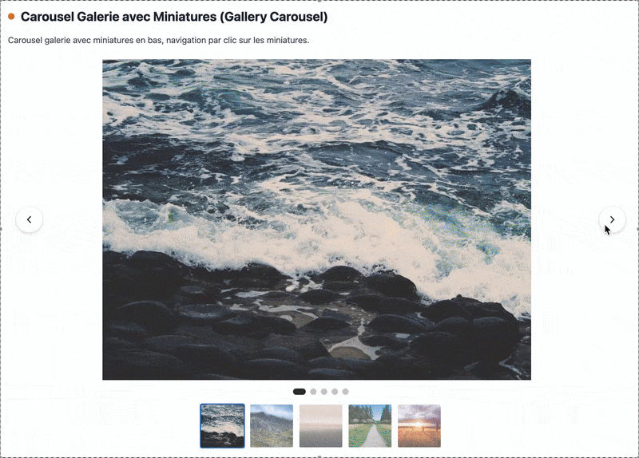

# PHP Carousel

[🇬🇧 Lire en anglais](README.md) | [🇫🇷 Lire en français](README.fr.md)

## 💝 Soutenir le projet

Si ce bundle vous est utile, envisagez de [devenir un sponsor](https://github.com/sponsors/julien-lin) pour soutenir le développement et la maintenance de ce projet open source.

---

Une librairie de carrousels moderne et performante pour PHP avec des designs élégants. Implémentation CSS/JS native pure avec **zéro dépendance externe**.

## 🚀 Installation

```bash
composer require julienlinard/php-carousel
```

**Requirements** : PHP 8.2 ou supérieur

### Dépendances Optionnelles

La librairie core n'a **aucune dépendance externe**. Cependant, si vous souhaitez utiliser les intégrations Twig ou Blade, vous devez installer les packages correspondants :

**Pour l'intégration Twig :**
```bash
composer require twig/twig
```

**Pour l'intégration Blade (Laravel) :**
```bash
composer require illuminate/support
```

> **Note** : Ces dépendances sont optionnelles. La fonctionnalité core du carousel fonctionne sans elles. Elles sont uniquement nécessaires si vous utilisez les extensions Twig ou Blade.

## ⚡ Démarrage rapide

### Carousel d'images simple

```php
<?php

require_once __DIR__ . '/vendor/autoload.php';

use JulienLinard\Carousel\Carousel;

// Créer un carousel d'images
$carousel = Carousel::image('mon-carousel', [
    'https://example.com/image1.jpg',
    'https://example.com/image2.jpg',
    'https://example.com/image3.jpg',
]);

// Afficher le carousel
echo $carousel->render();
```

### Carousel de cartes

```php
use JulienLinard\Carousel\Carousel;

$carousel = Carousel::card('produits', [
    [
        'id' => '1',
        'title' => 'Produit 1',
        'content' => 'Description du produit 1',
        'image' => 'https://example.com/produit1.jpg',
        'link' => '/produit/1',
    ],
    [
        'id' => '2',
        'title' => 'Produit 2',
        'content' => 'Description du produit 2',
        'image' => 'https://example.com/produit2.jpg',
        'link' => '/produit/2',
    ],
], [
    'itemsPerSlide' => 3,
    'itemsPerSlideMobile' => 1,
]);

echo $carousel->render();
```

### Carousel de témoignages

```php
use JulienLinard\Carousel\Carousel;

$carousel = Carousel::testimonial('temoignages', [
    [
        'id' => '1',
        'title' => 'Jean Dupont',
        'content' => 'Ce produit a changé ma vie ! Je le recommande vivement.',
        'image' => 'https://example.com/avatar1.jpg',
    ],
    [
        'id' => '2',
        'title' => 'Marie Martin',
        'content' => 'Qualité exceptionnelle et service client excellent.',
        'image' => 'https://example.com/avatar2.jpg',
    ],
], [
    'transition' => 'fade',
    'autoplayInterval' => 6000,
]);

echo $carousel->render();
```

## 🎨 Démonstrations Visuelles

Découvrez les carrousels en action ! Chaque type est entièrement personnalisable et responsive avec des animations fluides.

### Carousel d'Images
Parfait pour les bannières hero et les galeries d'images avec des transitions de glissement fluides.


### Carousel de Cartes
Idéal pour les listes de produits, articles de blog ou présentations de fonctionnalités. Affiche plusieurs éléments par slide.


### Carousel de Témoignages
De belles transitions en fondu pour les avis clients et témoignages.


### Carousel Galerie
Galerie avancée avec navigation par miniatures pour une navigation facile.



## 📋 Fonctionnalités

- ✅ **Zéro Dépendance** - Implémentation CSS/JS native pure
- ✅ **Types Multiples** - Carrousels Image, Carte, Témoignage, Galerie, Infini
- ✅ **Méthodes Factory Statiques** - `infiniteCarousel()`, `heroBanner()`, `productShowcase()`, `testimonialSlider()`
- ✅ **Intégration Twig & Blade** - Extensions prêtes à l'emploi pour les moteurs de templates populaires
- ✅ **Entièrement Responsive** - Optimisé mobile, tablette et desktop
- ✅ **Swipe Tactile** - Support des gestes tactiles natifs
- ✅ **Navigation Clavier** - Contrôles clavier accessibles
- ✅ **Lecture Automatique** - Autoplay configurable avec pause au survol
- ✅ **Animations Fluides** - Transitions et transformations CSS
- ✅ **Chargement Différé** - Lazy loading d'images intégré avec Intersection Observer
- ✅ **Personnalisable** - Options de configuration étendues
- ✅ **Conforme WCAG 2.1 AA** - Support complet de l'accessibilité (ARIA, lecteurs d'écran, prefers-reduced-motion)
- ✅ **Sécurité** - Prévention XSS, validation d'URL, sanitization des entrées
- ✅ **Performance** - Architecture de renderers modulaire, JavaScript optimisé, minification CSS/JS, virtualisation pour grands carrousels
- ✅ **Thèmes** - Support Dark/Light mode avec détection automatique des préférences système
- ✅ **Virtualisation** - Optimisation automatique des performances pour carrousels avec 50+ items
- ✅ **Server-Side Rendering (SSR)** - Génération HTML statique pour SEO et cache CDN
- ✅ **Gestion d'Erreurs** - Placeholders pour images en erreur, indicateurs de chargement

## 📖 Documentation

- [Référence API](docs/API.md) - Documentation API complète
- [Intégration CMS](docs/INTEGRATION_CMS.md) - WordPress, PrestaShop, Drupal
- [Intégration Twig](docs/INTEGRATION_TWIG.md) - Moteur de template Twig
- [Intégration Blade](docs/INTEGRATION_BLADE.md) - Template Laravel Blade
- [Intégration React](docs/INTEGRATION_REACT.md) - Intégration React.js
- [Intégration Vue](docs/INTEGRATION_VUE.md) - Intégration Vue.js

### Types de Carrousels

#### Carousel d'Images

Parfait pour les galeries d'images et les bannières hero.


```php
$carousel = Carousel::image('galerie', [
    'image1.jpg',
    'image2.jpg',
    'image3.jpg',
], [
    'height' => '500px',
    'showDots' => true,
    'showArrows' => true,
]);
```

#### Carousel de Cartes

Idéal pour les listes de produits, articles de blog ou cartes de fonctionnalités.


```php
$carousel = Carousel::card('produits', $produits, [
    'itemsPerSlide' => 3,
    'itemsPerSlideDesktop' => 3,
    'itemsPerSlideTablet' => 2,
    'itemsPerSlideMobile' => 1,
    'gap' => 24,
]);
```

#### Carousel de Témoignages

Parfait pour les avis clients et témoignages.


```php
$carousel = Carousel::testimonial('avis', $temoignages, [
    'transition' => 'fade',
    'autoplayInterval' => 7000,
]);
```

#### Carousel Galerie

Galerie avancée avec navigation par miniatures.


```php
$carousel = Carousel::gallery('galerie-photos', $images, [
    'showThumbnails' => true,
    'itemsPerSlide' => 1,
]);
```

### Options de Configuration

```php
$carousel = new Carousel('mon-carousel', Carousel::TYPE_IMAGE, [
    // Autoplay
    'autoplay' => true,                    // Activer/désactiver l'autoplay
    'autoplayInterval' => 5000,             // Intervalle d'autoplay en millisecondes
    
    // Navigation
    'showArrows' => true,                  // Afficher les flèches de navigation
    'showDots' => true,                    // Afficher les indicateurs de points
    'showThumbnails' => false,            // Afficher les miniatures (galerie uniquement)
    
    // Mise en page
    'itemsPerSlide' => 1,                  // Nombre d'éléments par slide
    'itemsPerSlideDesktop' => 1,           // Éléments par slide desktop
    'itemsPerSlideTablet' => 1,            // Éléments par slide tablette
    'itemsPerSlideMobile' => 1,            // Éléments par slide mobile
    'gap' => 16,                           // Espacement entre les éléments (px)
    
    // Animation
    'transition' => 'slide',               // 'slide', 'fade', 'cube'
    'transitionDuration' => 500,           // Durée de transition (ms)
    
    // Comportement
    'loop' => true,                        // Boucle à travers les slides
    'responsive' => true,                  // Activer le comportement responsive
    'lazyLoad' => true,                    // Activer le lazy loading
    'keyboardNavigation' => true,          // Activer la navigation clavier
    'touchSwipe' => true,                  // Activer le swipe tactile
    
    // Style
    'height' => 'auto',                    // Hauteur du carousel
    'width' => '100%',                     // Largeur du carousel
]);
```

### Utilisation Avancée

#### Items Personnalisés

```php
use JulienLinard\Carousel\Carousel;
use JulienLinard\Carousel\CarouselItem;

$carousel = new Carousel('personnalise', Carousel::TYPE_CARD);

$carousel->addItem(new CarouselItem(
    id: 'item1',
    title: 'Item Personnalisé',
    content: 'Ceci est un item de carousel personnalisé',
    image: 'https://example.com/image.jpg',
    link: '/item/1',
    attributes: ['class' => 'custom-class']
));

$carousel->addItem([
    'id' => 'item2',
    'title' => 'Autre Item',
    'content' => 'Ajouté depuis un tableau',
    'image' => 'https://example.com/image2.jpg',
]);

echo $carousel->render();
```

#### Séparer HTML, CSS et JS

```php
// Afficher uniquement le HTML
echo $carousel->renderHtml();

// Afficher uniquement le CSS (dans <head>)
echo $carousel->renderCss();

// Afficher uniquement le JavaScript (avant </body>)
echo $carousel->renderJs();
```

#### Support Thèmes Dark/Light

```php
// Thème automatique (respecte les préférences système)
$carousel = Carousel::image('galerie', $images, [
    'theme' => 'auto', // Bascule automatiquement selon prefers-color-scheme
]);

// Thème clair
$carousel = Carousel::card('produits', $produits, [
    'theme' => 'light',
]);

// Thème sombre
$carousel = Carousel::image('hero', $bannières, [
    'theme' => 'dark',
]);

// Couleurs de thème personnalisées
$carousel = Carousel::card('custom', $items, [
    'theme' => 'light',
    'themeColors' => [
        'light' => [
            'background' => '#ffffff',
            'text' => '#000000',
            'cardBackground' => '#f5f5f5',
        ],
        'dark' => [
            'background' => '#1a1a1a',
            'text' => '#ffffff',
            'cardBackground' => '#2a2a2a',
        ],
    ],
]);
```

#### Virtualisation pour Grands Carrousels

```php
// Activer la virtualisation pour les performances avec beaucoup d'items
$carousel = Carousel::image('grande-galerie', $beaucoupImages, [
    'virtualization' => true,
    'virtualizationBuffer' => 5, // Afficher 5 slides de chaque côté
]);

// Activation automatique quand les items dépassent le seuil (par défaut: 50)
$carousel = Carousel::gallery('galerie-photos', $beaucoupPhotos, [
    'virtualizationThreshold' => 30, // Activer à 30 items au lieu de 50
]);
```

#### Transitions et Animations Personnalisées

```php
// Transition personnalisée
$carousel = Carousel::image('custom', $images, [
    'customTransition' => [
        'duration' => 600,
        'timingFunction' => 'cubic-bezier(0.4, 0, 0.2, 1)',
        'properties' => ['transform', 'opacity'],
    ],
]);

// Animations personnalisées (simples)
$carousel = Carousel::card('animated', $cartes, [
    'animations' => [
        'slideIn' => 'slideInFromRight 0.5s ease-out',
        'slideOut' => 'slideOutToLeft 0.5s ease-in',
    ],
]);

// Animations personnalisées (avec keyframes)
$carousel = Carousel::image('keyframes', $images, [
    'animations' => [
        'fadeIn' => [
            'keyframes' => [
                'name' => 'carousel-fade-in',
                'steps' => [
                    '0%' => ['opacity' => '0'],
                    '100%' => ['opacity' => '1'],
                ],
            ],
            'duration' => '0.5s',
            'timingFunction' => 'ease-out',
        ],
    ],
]);
```

#### Export/Import de Configuration

```php
// Exporter la configuration du carousel
$carousel = Carousel::image('galerie', $images, [
    'autoplay' => true,
    'theme' => 'dark',
]);
$config = $carousel->exportConfig();

// Sauvegarder dans un fichier
file_put_contents('carousel-config.json', json_encode($config, JSON_PRETTY_PRINT));

// Charger et restaurer depuis un fichier
$savedConfig = json_decode(file_get_contents('carousel-config.json'), true);
$restoredCarousel = Carousel::fromConfig($savedConfig);
```

#### Server-Side Rendering (SSR)

```php
// Générer HTML statique (parfait pour SSR, cache, CDN)
$carousel = Carousel::image('galerie', $images);
$staticHtml = $carousel->renderStatic();
// Ce HTML peut être mis en cache, servi via CDN, indexé par les moteurs de recherche

// Ajouter JavaScript pour l'interactivité (amélioration progressive)
$fullHtml = $carousel->hydrate($staticHtml);
// Ou charger JavaScript de manière asynchrone côté client
```

**Avantages SSR :**
- ✅ SEO parfait (contenu dans HTML)
- ✅ Chargement initial rapide (pas de JavaScript requis)
- ✅ Mise en cache CDN possible
- ✅ Amélioration progressive (ajouter JS quand nécessaire)

#### Plusieurs Carrousels sur la Même Page

```php
$carousel1 = Carousel::image('carousel-1', $images1);
$carousel2 = Carousel::card('carousel-2', $cartes);

// Chaque carousel a des IDs et styles uniques
echo $carousel1->render();
echo $carousel2->render();
```

## 🎨 Styling

Le carousel utilise du CSS pur sans dépendances externes. Tous les styles sont limités au conteneur du carousel pour éviter les conflits.

### Style Personnalisé

Vous pouvez surcharger les styles en utilisant CSS :

```css
#carousel-mon-carousel .carousel-arrow {
    background: #votre-couleur;
}

#carousel-mon-carousel .carousel-dot.active {
    background: #votre-couleur;
}
```

## 📚 API Reference

### Classe Carousel

#### Méthodes Factory Statiques

- `Carousel::image(string $id, array $images, array $options = []): self` - Carousel d'images
- `Carousel::card(string $id, array $cards, array $options = []): self` - Carousel de cartes
- `Carousel::testimonial(string $id, array $testimonials, array $options = []): self` - Carousel de témoignages
- `Carousel::gallery(string $id, array $images, array $options = []): self` - Carousel galerie
- `Carousel::infiniteCarousel(string $id, array $images, array $options = []): self` - Carousel infini
- `Carousel::heroBanner(string $id, array $banners, array $options = []): self` - Bannière hero
- `Carousel::productShowcase(string $id, array $products, array $options = []): self` - Showcase produits
- `Carousel::testimonialSlider(string $id, array $testimonials, array $options = []): self` - Slider témoignages

#### Méthodes d'Instance

- `addItem(CarouselItem|array $item): self` - Ajouter un seul item
- `addItems(array $items): self` - Ajouter plusieurs items
- `setOptions(array $options): self` - Définir les options du carousel
- `getOption(string $key, mixed $default = null): mixed` - Obtenir une valeur d'option
- `render(): string` - Afficher le carousel complet (HTML + CSS + JS)
- `renderHtml(): string` - Afficher uniquement le HTML
- `renderCss(): string` - Afficher uniquement le CSS
- `renderJs(): string` - Afficher uniquement le JavaScript
- `renderStatic(): string` - Afficher HTML statique avec CSS (SSR, sans JS)
- `hydrate(string $staticHtml): string` - Ajouter JavaScript au HTML statique
- `getId(): string` - Obtenir l'ID du carousel
- `getType(): string` - Obtenir le type de carousel
- `getItems(): array` - Obtenir tous les items
- `getOptions(): array` - Obtenir toutes les options
- `exportConfig(): array` - Exporter la configuration en array
- `fromConfig(array $config): self` - Créer un carousel depuis une configuration (statique)

### Classe CarouselItem

#### Constructeur

```php
new CarouselItem(
    string $id,
    string $title = '',
    string $content = '',
    string $image = '',
    string $link = '',
    array $attributes = []
)
```

#### Méthodes Statiques

- `CarouselItem::fromArray(array $data): self` - Créer depuis un tableau

#### Méthodes d'Instance

- `toArray(): array` - Convertir en tableau

## 💡 Exemples

### Exemple 1 : Carousel de Produits

```php
<?php

use JulienLinard\Carousel\Carousel;

$produits = [
    [
        'id' => '1',
        'title' => 'Casque Premium',
        'content' => 'Son de haute qualité avec annulation de bruit',
        'image' => '/images/casque.jpg',
        'link' => '/produits/casque',
    ],
    [
        'id' => '2',
        'title' => 'Souris Sans Fil',
        'content' => 'Design ergonomique avec longue autonomie',
        'image' => '/images/souris.jpg',
        'link' => '/produits/souris',
    ],
    // ... plus de produits
];

$carousel = Carousel::card('produits', $produits, [
    'itemsPerSlide' => 4,
    'itemsPerSlideDesktop' => 4,
    'itemsPerSlideTablet' => 2,
    'itemsPerSlideMobile' => 1,
    'gap' => 20,
    'autoplay' => true,
    'autoplayInterval' => 4000,
]);

echo $carousel->render();
```

### Exemple 2 : Carousel Bannière Hero

```php
<?php

use JulienLinard\Carousel\Carousel;

$bannieres = [
    [
        'id' => 'banniere1',
        'title' => 'Bienvenue dans Notre Boutique',
        'content' => 'Découvrez des produits incroyables',
        'image' => '/images/banniere1.jpg',
        'link' => '/boutique',
    ],
    [
        'id' => 'banniere2',
        'title' => 'Soldes d\'Été',
        'content' => 'Jusqu\'à 50% de réduction sur les articles sélectionnés',
        'image' => '/images/banniere2.jpg',
        'link' => '/soldes',
    ],
];

$carousel = Carousel::image('hero', $bannieres, [
    'height' => '600px',
    'autoplay' => true,
    'autoplayInterval' => 5000,
    'transition' => 'fade',
]);

echo $carousel->render();
```

### Exemple 3 : Témoignages Clients

```php
<?php

use JulienLinard\Carousel\Carousel;

$temoignages = [
    [
        'id' => '1',
        'title' => 'Sarah Johnson',
        'content' => 'Le meilleur service que j\'ai jamais connu. Je recommande vivement !',
        'image' => '/avatars/sarah.jpg',
    ],
    [
        'id' => '2',
        'title' => 'Michael Chen',
        'content' => 'Qualité exceptionnelle et livraison rapide. Je commanderai à nouveau !',
        'image' => '/avatars/michael.jpg',
    ],
];

$carousel = Carousel::testimonial('temoignages', $temoignages, [
    'transition' => 'fade',
    'autoplayInterval' => 6000,
    'showDots' => true,
]);

echo $carousel->render();
```

## 🔌 Intégrations

### Intégration Twig

Voir [INTEGRATION_TWIG.md](docs/INTEGRATION_TWIG.md) pour la documentation complète.

```twig
{# Utilisation simple #}
{{ carousel_infinite('products', images)|raw }}

{# Avec options #}
{{ carousel_hero('banner', banners, {
    'height': '700px',
    'autoplayInterval': 4000
})|raw }}
```

### Intégration Blade (Laravel)

Voir [INTEGRATION_BLADE.md](docs/INTEGRATION_BLADE.md) pour la documentation complète.

```blade
{{-- Directives --}}
@carousel_infinite('products', $images)
@carousel_hero('banner', $banners, ['height' => '700px'])

{{-- Helpers --}}
{!! carousel_infinite('products', $images)->render() !!}
```

## 🧪 Tests

```bash
composer test
```

**Couverture des Tests :**
- ✅ 60 tests, 200 assertions
- ✅ Tests de sécurité (prévention XSS, validation URL, sanitization)
- ✅ Tests d'accessibilité (attributs ARIA, lecteurs d'écran, prefers-reduced-motion)
- ✅ Tests d'intégration (Twig, Blade)
- ✅ Tests fonctionnels (tous les types de carrousels et méthodes)

## 📚 Documentation Additionnelle

- **[Référence API](docs/API.md)** - Documentation API complète
- **[Intégration Twig](docs/INTEGRATION_TWIG.md)** - Guide d'extension Twig
- **[Intégration Blade](docs/INTEGRATION_BLADE.md)** - Guide Laravel Blade
- **[Exemples d'Utilisation](docs/EXEMPLES_UTILISATION.md)** - Plus d'exemples

## 📝 License

MIT License - Voir le fichier LICENSE pour plus de détails.

## 🤝 Contribution

Les contributions sont les bienvenues ! N'hésitez pas à ouvrir une issue ou une pull request.

## 📧 Support

Pour toute question ou problème, veuillez ouvrir une issue sur GitHub.

## 💝 Soutenir le projet

Si ce bundle vous est utile, envisagez de [devenir un sponsor](https://github.com/sponsors/julien-lin) pour soutenir le développement et la maintenance de ce projet open source.

---

**Développé avec ❤️ par Julien Linard**

